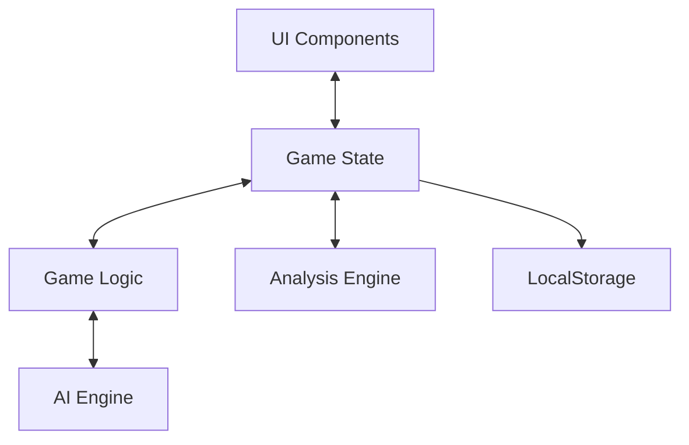

# System Patterns: Scopa Trainer

## Architecture Overview

The Scopa Trainer is implemented as a client-side browser application with a modular, event-driven architecture:



## Key Design Patterns

### Game State Management
- **Centralized State**: A single `gameState` object tracks all aspects of the game
- **Immutable Snapshots**: State history is preserved for move analysis and replay
- **Event-Driven Updates**: UI responds to state changes rather than directly modifying visuals

### Rendering System
- **Component-Based Rendering**: Game board, cards, hands, and controls are modular
- **Visual Feedback Pattern**: Selected cards have visual indicators
- **Declarative Updates**: UI renders from state rather than imperative mutations

### AI Implementation
- **Strategic Prioritization**: AI uses a priority-based decision system rather than pure minimax
- **Non-Deterministic Play**: Some randomness to prevent predictable patterns
- **Transparent Reasoning**: AI explains its move rationale for learning purposes

### Analysis Engine
- **Move Classification**: Player moves categorized into optimal, good, mediocre, or bad
- **Comparative Analysis**: Player moves compared against optimal AI recommendations
- **Progressive Disclosure**: Analysis shown post-game with interactive navigation

## Data Structures

### Core Game Objects
- **Card**: `{suit: string, value: number, id: string}`
- **Deck**: Array of Card objects
- **Player Hand**: Array of Card objects
- **Table**: Array of Card objects
- **Captures**: Array of Card objects per player

### Game State
```javascript
{
    deck: Card[],
    table: Card[],
    playerHand: Card[],
    aiHand: Card[],
    playerCaptures: Card[],
    aiCaptures: Card[],
    playerScopaCount: number,
    aiScopaCount: number,
    playerScore: number,
    aiScore: number,
    selectedCard: Card | null,
    selectedTableCards: Card[],
    currentTurn: 'player' | 'ai',
    gameOver: boolean,
    moveCount: number
}
```

### Move Analysis Record
```javascript
{
    moveNumber: number,
    card: Card,
    action: 'capture' | 'discard',
    capturedCards: Card[],
    allPossibleCaptures: Card[][],
    tableState: Card[],
    playerHand: Card[],
    wasOptimal: boolean,
    rating: 'good' | 'mediocre' | 'bad',
    reason: string,
    aiRecommendation: {
        card: Card,
        tableCards: Card[],
        reasoning: string,
        priority: string
    }
}
```

## Core Algorithms

### Card Capture Logic
- **Direct Matching**: Card equals a single table card value
- **Combination Capture**: Card value equals sum of multiple table cards
- **Combinatorial Search**: Find all possible valid capture combinations

### AI Decision Making
1. Check for Scopa opportunities (clear the table)
2. Prioritize capturing high-value cards (7 of coins)
3. Look for opportunities to capture multiple cards
4. Make strategic discards to minimize opponent capture opportunities
