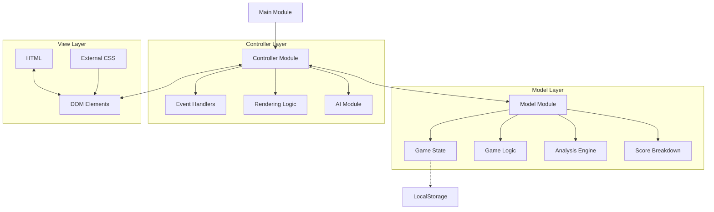

# System Patterns: Scopa Trainer

## Architecture Overview

The Scopa Trainer is implemented as a client-side browser application with a modular, event-driven architecture based on the Model-View-Controller (MVC) pattern:



## Key Design Patterns

### Game State Management
- **Centralized State**: A single `gameState` object tracks all aspects of the game
- **Immutable Snapshots**: State history is preserved for move analysis and replay
- **Event-Driven Updates**: UI responds to state changes rather than directly modifying visuals
- **Real-time Score Analysis**: Score breakdown continuously updates to reflect current game state

### Rendering System
- **Component-Based Rendering**: Game board, cards, hands, and controls are modular
- **Visual Feedback Pattern**: Selected cards and score advantages have visual indicators
- **Declarative Updates**: UI renders from state rather than imperative mutations
- **Separated Presentation**: HTML structure, CSS styling, and JavaScript behavior are in separate files

### AI Implementation
- **Pure Function Pattern**: AI is implemented as a module with pure functions that receive only the information an AI player would know
- **Strategic Prioritization**: AI uses a priority-based decision system
- **Non-Deterministic Play**: Some randomness to prevent predictable patterns
- **Transparent Reasoning**: AI explains its move rationale for learning purposes

### Analysis Engine
- **Move Classification**: Player moves categorized into optimal, good, mediocre, or bad
- **Comparative Analysis**: Player moves compared against optimal AI recommendations
- **Progressive Disclosure**: Analysis shown post-game with interactive navigation

## Data Structures

### Core Game Objects
- **Card**: `{suit: string, value: number, id: string}`
- **Deck**: Array of Card objects
- **Player Hand**: Array of Card objects
- **Table**: Array of Card objects
- **Captures**: Array of Card objects per player

### Game State
```javascript
{
    deck: Card[],
    table: Card[],
    playerHand: Card[],
    aiHand: Card[],
    playerCaptures: Card[],
    aiCaptures: Card[],
    playerScopaCount: number,
    aiScopaCount: number,
    playerScore: number,
    aiScore: number,
    selectedCard: Card | null,
    selectedTableCards: Card[],
    currentTurn: 'player' | 'ai',
    gameOver: boolean,
    moveCount: number
}
```

### Score Breakdown
```javascript
{
    player: {
        cardsCaptured: number,
        coinsCaptured: number,
        hasSetteBello: boolean,
        primieraCards: {
            sevens: number,
            sixes: number,
            aces: number
        },
        scopaCount: number,
        cardAdvantage: 'normal' | 'strong' | null,
        coinAdvantage: 'normal' | 'strong' | null,
        primieraAdvantage: 'normal' | 'strong' | null
    },
    ai: {
        // Same structure as player
    }
}
```

### AI Game State
```javascript
{
    tableCards: Card[],              // Cards visible to all players
    handCards: Card[],               // Cards in AI's hand
    captureCards: Card[],            // Cards AI has captured
    opponentCaptureCards: Card[],    // Cards opponent has captured 
    outstandingCards: Card[]         // Cards not visible (in deck or opponent's hand)
}
```

### Move Analysis Record
```javascript
{
    moveNumber: number,
    card: Card,
    action: 'capture' | 'discard',
    capturedCards: Card[],
    allPossibleCaptures: Card[][],
    tableState: Card[],
    playerHand: Card[],
    wasOptimal: boolean,
    rating: 'good' | 'mediocre' | 'bad',
    reason: string,
    aiRecommendation: {
        card: Card,
        tableCards: Card[],
        reasoning: string,
        priority: string
    }
}
```

## Core Algorithms

### Card Capture Logic
- **Direct Matching**: Card equals a single table card value
- **Combination Capture**: Card value equals sum of multiple table cards
- **Combinatorial Search**: Find all possible valid capture combinations
- **Legal Moves System**: Centralized validation of all possible legal moves

### Move Validation
- **Unified Legal Moves**: A central `findAllLegalMoves` function determines all valid moves
- **Rule Enforcement**: Special rules like prioritizing direct matches are enforced consistently
- **Move Generation**: Both capture and discard moves are generated based on current game state

### AI Decision Making
1. Model provides AI's limited view of the game state (only what it would know)
2. Model provides all legal moves to the AI module
3. AI pure function processes the legal moves with the limited game state:
   - Check for Scopa opportunities (clear the table)
   - Prioritize capturing high-value cards (7 of coins)
   - Look for opportunities to capture multiple cards
4. AI returns the chosen move and rationale without modifying any state
5. Controller takes the AI's decision and executes the chosen move through the model
